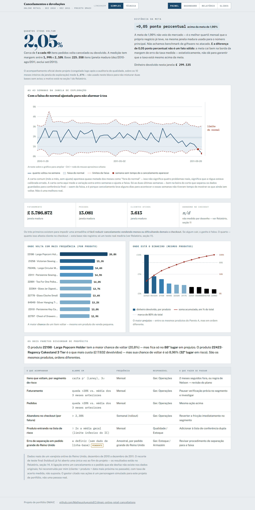
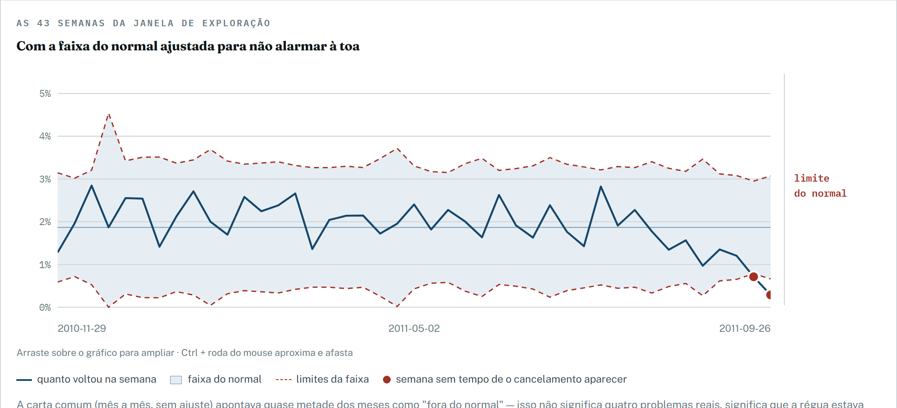
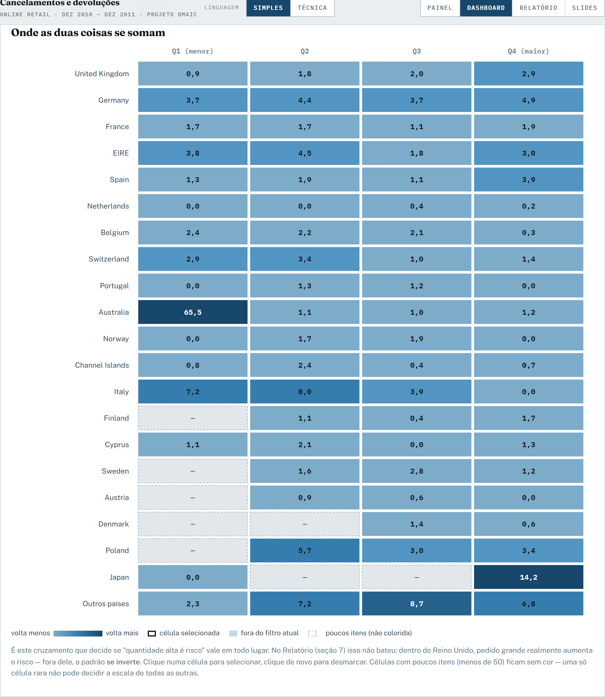
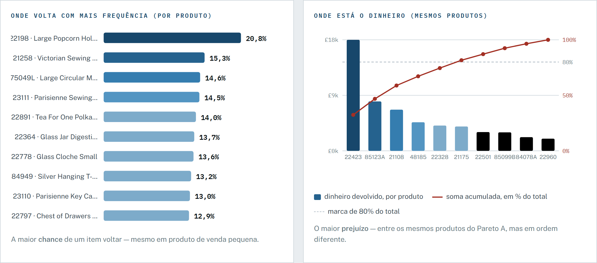

# Onde este varejista perde dinheiro com cancelamento — e como estancar sem afastar cliente

Cerca de 1 a cada 49 itens vendidos volta cancelado ou devolvido. O problema não está espalhado: se concentra num grupo fechado de ~66 produtos específicos e em pedidos grandes — mas só quando são do Reino Unido. Recomendo conferência dupla nesses dois pontos, com o ganho estimado condicionado a um teste real antes de qualquer rollout, porque a margem para dar errado é pequena.

**[Ver a página interativa](https://matheusaugustoec.github.io/dmaic-online-retail-cancellations/)** · [Relatório completo](https://matheusaugustoec.github.io/dmaic-online-retail-cancellations/#relatorio) · Matheus Augusto da Silva — [GitHub](https://github.com/MatheusAugustoEC) · [LinkedIn](https://linkedin.com/in/matheusaugustodasilva98)

`Python` · `pandas` · `NumPy` · `SciPy` · `statsmodels` · `pytest` · `HTML/CSS/JS` · `GitHub Pages` · `DMAIC (Lean Seis Sigma)`



## 1. O problema

Um varejista britânico de giftware perde **2,05%** dos itens pedidos para cancelamento ou devolução, na janela madura de exploração (dez/2010–ago/2011, n=225.558, IC 95%: 1,99%–2,10%) — cerca de **1 a cada 49** itens, **£299.135** em receita estornada nessa janela. A meta interna (o melhor quartil mensal que o próprio negócio já bateu) é 1,99%: a diferença de 0,05 ponto percentual é pequena demais para garantir que a taxa está mesmo acima da meta. A carta de controle (semanal, ajustada para não alarmar à toa) mostra um processo **estável**: a variação é o que o sistema já entrega por construção, não um evento pontual — reduzi-la exige mudar uma regra, não cobrar mais esforço de quem executa.


*A régua certa muda a conclusão: uma carta mensal simples apontaria quase metade dos meses como "fora do normal". Ver no [Painel](https://matheusaugustoec.github.io/dmaic-online-retail-cancellations/#painel).*

## 2. A solução

A causa mais robusta é **produto específico**: 66 de 1.399 produtos avaliados têm taxa de cancelamento pelo menos 2 vezes a média geral, com margem de segurança. A segunda é **pedido grande, mas só dentro do Reino Unido** — fora dele, o padrão se inverte. Recomendo **conferência dupla na separação** desses produtos sinalizados e dos pedidos grandes do Reino Unido, com uma **confirmação extra no checkout** só como reforço, condicionada aos dois critérios ao mesmo tempo — nunca isolada.

A conta de ganho cobre só a parte mais frágil da recomendação (os segmentos de risco por país×quantidade; a conferência dos 66 produtos não tem custo estimável com este dado). Ganho central: **£6.761**. No cenário conservador (a verificação evita só 20% dos cancelamentos), o resultado **já é prejuízo**. O número que decide não é o ganho — é o **ponto de indiferença: 2,38%**. Se mais de 1 em cada 42 faturas legítimas do segmento sinalizado for abandonada por causa da fricção extra, o ganho desaparece. Por isso o Relatório propõe um **experimento real** (seção 11) antes de qualquer rollout, em vez de recomendar a implementação direta.

## 3. O que descobri

O produto específico (H4) é a única causa isoladamente acionável — algumas taxas chegam a mais de 10 vezes a média. Pedido grande (H1) é real, mas só quando **testei antes** se era um artefato de país ou de tipo de cliente (H5, hipótese rival): o efeito **se inverte** fora do Reino Unido, então nenhuma trava por quantidade sozinha seria segura. País estrangeiro isolado (H2) é real mas pequeno demais para virar recomendação.


*É este cruzamento que testa se "quantidade alta é risco" vale em todo lugar — não vale. Explorar no [Dashboard](https://matheusaugustoec.github.io/dmaic-online-retail-cancellations/#dashboard).*

Juntando as três causas testadas, **51,8%** das linhas com defeito têm explicação — os outros 48,2% não têm causa identificável neste dado, e isso é honestidade, não uma lacuna escondida. A abertura do holdout, no fim do projeto, sustentou os três segmentos de risco e a lista de produtos sinalizados (taxa 3,1x a média no holdout, perto do critério de corte de 2x usado na exploração).


*Uma armadilha comum: os dois rankings existem para perguntas diferentes, e uso o de impacto para priorizar a conferência dupla. Ver no [Painel](https://matheusaugustoec.github.io/dmaic-online-retail-cancellations/#painel).*

## Como cheguei lá

| Fase | A pergunta | O que descobri | Documento |
|---|---|---|---|
| Fase 0 · Reconhecimento | O dado sustenta uma pergunta de causa, ou só descreve? | Não existe chave entre um cancelamento e o pedido que ele desfaz; pareamento por proximidade (cliente+produto+data) recupera a maioria dos casos, não todos | `src/fase0_profiling.py`, `src/fase0_timeline_e_pareamento.py` |
| Fase 1 · Define | Qual pergunta, para quem, e com que régua de "efeito grande o suficiente para agir"? | Persona de decisão simulada (Gerente de Operações); efeito mínimo prático pré-registrado para cada hipótese, antes de olhar qualquer dado de relação | [`docs/define-charter.md`](docs/define-charter.md), [`docs/pre-registro-hipoteses.md`](docs/pre-registro-hipoteses.md) |
| Fase 2A · Measure | Este dado merece confiança? | A taxonomia de código de produto mistura produto real com frete/ajuste/desconto; um quarto dos itens não tem cliente identificado, concentrado no Reino Unido | [`docs/measure-2a-procedencia.md`](docs/measure-2a-procedencia.md) |
| Fase 2B · Measure | Qual é a taxa real, e o processo é estável? | Baseline congelado de 1,87% (10 meses); a carta de controle simples (mensal) alarmava demais — sinal de régua errada, não de muitos problemas | [`docs/measure-2b-baseline.md`](docs/measure-2b-baseline.md) |
| Fase 3 · Analyze | Por que os pedidos cancelam? | Testei a explicação rival (H5) antes das óbvias: quantidade alta só é risco dentro do Reino Unido; produto específico é a causa mais robusta e a única isoladamente acionável | [`docs/analyze-causa-raiz.md`](docs/analyze-causa-raiz.md) |
| Fase 4 · Improve | O que fazer, e vale a pena fazer? | Contramedidas condicionadas, nunca por país ou quantidade isolados; o ganho central é frágil — o ponto de indiferença, não o ganho bruto, decide | [`docs/improve-recomendacao.md`](docs/improve-recomendacao.md) |
| Fase 5 · Control | Como sustentar sem alarme falso? | A carta p′ de Laney (semanal) substitui a carta mensal simples; plano de 5 indicadores, cada um com limite, responsável e ação escrita antes do problema acontecer | [`docs/control-plano.md`](docs/control-plano.md), [`docs/holdout_resultado.json`](docs/holdout_resultado.json) |
| Entrega | Como apresentar para quem não vai ler nem o código nem o dossiê? | Página única com Painel, Dashboard, Relatório e Slides, em dois registros de linguagem, publicada e auditada | [página publicada](https://matheusaugustoec.github.io/dmaic-online-retail-cancellations/) |
| Revisão por banca | A história se sustenta sob crítica de fora? | 2 críticos e 8 importantes corrigidos na 1ª rodada; aprovada com ressalvas nas rodadas seguintes, sem crítico restante | [`docs/revisao/`](docs/revisao/) |

## Revisão independente

Uma banca simulada (gestor de operações, especialista de logística reversa, cientista de dados sênior e recrutador) revisou a página publicada, de fora, em três rodadas. **Rodada 1: REPROVADO** — 2 achados críticos (o produto de "maior prejuízo" era 99,5% uma única transação isolada, não um padrão; e a conta do ponto de indiferença misturava linha de produto com fatura) e 8 importantes, todos corrigidos. **Rodada 2: APROVADO COM RESSALVAS** — nenhum crítico restante. **Rodada 3: APROVADO COM RESSALVAS** — achados só de interface (posicionamento de rótulo, zoom em gráfico), nenhum mudando número ou conclusão. Mostrar o que foi corrigido é parte do método, não um detalhe a esconder — pareceres completos em [`docs/revisao/`](docs/revisao/).

## Ferramentas e métodos

| Camada | O que foi usado | Para quê |
|---|---|---|
| Linguagem e dados | Python, pandas, NumPy | Todo o pipeline de leitura, tratamento e agregação |
| Estatística | SciPy, statsmodels | Testes de hipótese, IC de Wilson, tabela estratificada (Breslow-Day), poder de teste |
| Gráficos das fases | Matplotlib | Cartas de controle e Paretos gerados no Measure e no Control |
| Qualidade de dado | pytest | Testes automáticos da auditoria de qualidade (Control) |
| Apresentação | HTML, CSS, JavaScript (sem framework) | Página única com 4 modos e gráficos SVG desenhados sob medida |
| Publicação | GitHub Pages | Hospedagem da página interativa |
| Método — DMAIC (Lean Seis Sigma) | Estrutura de fases, com tollgate de aprovação a cada uma | Disciplina do processo, não só da análise |
| Método — pré-registro com efeito mínimo prático | Limiar de efeito escrito antes de olhar o dado, para cada hipótese | Evita confundir "estatisticamente diferente de zero" com "grande o suficiente para agir" |
| Método — hipótese rival testada primeiro | H5 (composição de país/cliente) testada antes de H1 (quantidade) | Evita atribuir causa a quantidade antes de descartar uma explicação alternativa mais simples |
| Método — carta p′ de Laney | Carta de controle semanal ajustada para sobredispersão | Evita alarme falso que a carta p clássica mensal produzia |
| Método — IC de Wilson | Intervalo de confiança para proporção | Critério de corte da lista de produtos de risco (H4), não a taxa pontual sozinha |
| Método — correção de Holm | Ajuste do nível de significância sobre a família de hipóteses confirmatórias | Controla falso positivo ao testar 4 hipóteses no mesmo projeto |
| Método — holdout temporal aberto uma vez | ~2,3 meses finais guardados e só abertos ao fim do Control | Confirmação fora da amostra que gerou as conclusões |
| Método — revisão independente por banca | Simulação de crítica externa em rodadas sucessivas | Acha o que a auditoria própria não acha |

## Limitações

- **Não existe a chave que liga um cancelamento ao pedido original.** Reconstruída por cliente+produto+data mais próxima, com 85% de acerto — toda conclusão de causa vale só para esse subconjunto.
- **Não sei o motivo da devolução.** Produto quebrado, erro de separação e arrependimento aparecem iguais nos dados.
- **Não sei quem desistiu de comprar por causa de fricção.** A base só registra pedido feito, nunca carrinho abandonado.
- **Não sei o custo do frete de devolução.** Toda conta de ganho é em receita bruta, nunca em lucro líquido — por isso o ponto de indiferença, não o ganho, é o número que decide.
- **Um quarto dos itens não tem cliente identificado**, concentrado no Reino Unido — conclusões por cliente valem só para os que restam.
- **Um único ano de dados, um único pico de fim de ano** — não dá para separar sazonalidade genuína de acaso, e o pico caiu justamente no período reservado como teste final.
- **Não sei se um cancelamento foi iniciativa do cliente ou correção do próprio vendedor.**

## Como reproduzir

Python 3.11. O dado (`online_retail.csv`, UCI Machine Learning Repository, "Online Retail", Chen/Sain/Guo 2012, CC BY 4.0) não está versionado — baixe e coloque na raiz do projeto.

```bash
pip install -r requirements.txt

python src/fase0_profiling.py
python src/fase0_timeline_e_pareamento.py
python src/fase2a_msa_procedencia.py
python src/fase2b_baseline.py
python src/fase3_analyze.py
python src/fase4_improve.py
python src/fase5_abertura_holdout.py   # já aberto neste projeto — não rodar de novo aqui
pytest tests/
python src/fase6_dados_entrega.py
python src/fase6_injetar_html.py
```

## Estrutura do repositório

```
docs/              página publicada (GitHub Pages) e o documento de cada fase
docs/revisao/      pareceres da banca e os prompts de correção de cada rodada
docs/img/          capturas da página usadas neste README
src/               scripts de cada fase, na ordem de execução
tests/             testes automáticos da auditoria de qualidade de dado
reports/           gráficos gerados na Measure 2B
requirements.txt   versões exatas usadas neste projeto
```

## Autor

**Matheus Augusto da Silva** — [GitHub](https://github.com/MatheusAugustoEC) · [LinkedIn](https://linkedin.com/in/matheusaugustodasilva98)

Projeto conduzido com o Claude Code como assistente, sob a metodologia DMAIC que desenvolvi — o método, as decisões e a revisão são meus.
